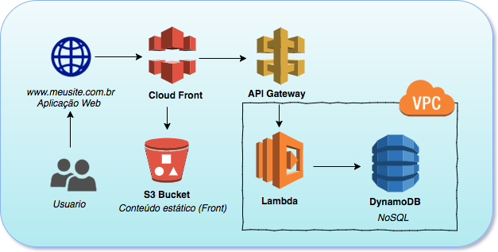

sse é um teste feito para conhecer um  pouco mais de cada candidato. Não se trata de um teste objetivo, capaz de gerar uma nota ou uma taxa de acerto, mas sim de um estudo de caso com o propósito de analisar os conhecimentos, experiências e modo de trabalhar de um cnadidato. Sinta-se livre para desenvolver sua solução para o problema proposto e em caso de dúvidas entre em contato no especialistafaz@mandic.net.br.

Seu objetivo nesse teste é subir um Wordpress na AWS.
Você provavelmente precisará criar uma conta free-tier na AWS, ou utilizar uma sua já existente. Mas não se preocupe, não iremos olhar sua conta ou chamar sua aplicação já rodando, queremos que você crie uma forma de podermos recriar toda sua infraestrutura em nossa conta de maneira simples. Você escolhe como. Crie um arquivo resolucao.md descrevendo todos os passos para que possamos executar sua infraestrutura em nosso ambiente.

* Você deverá partir de um ambiente na AWS sem nenhuma infraestrutura criada.

#### Subir a seguinte Stack:

* VPC separando subnets publicas e privadas.
* Utilizar EC2 para o Mysql.
* Utilizar EC2 para o Wordpress e Nginx.
* Todas as configurações precisam ser feitas com o configuration manager(Ansible, Puppet, Chef);
* Um Load Balancer apontando para a EC2 do Wordpress.
* A infraestrutura deve ser criada com um Orchestrator(Terrafrom ou Cloudformation)

### Extra

* Subir o Wordpress com alta disponibilidade.

* Subir toda a stack com apenas um comando.

---------------------------

# Arquitetura

Esse teste busca entender seus conceitos de arquitetura na AWS, observando um cenário já existente. Queremos saber se você entende a AWS e seus produtos e como funciona a comunicação entre eles.

#### Cenário
Observando a imagem abaixo, crie um arquivo arquitetura.md com a descrição técnica do fluxo dessa topologia, conforme seu entendimento.

# Entrega

* Você deve clonar esse repositório e commitar todas as modificações, porém, não abra um pull request ou deixe seu código de resposta aberto em um fork, por exemplo.
* Crie uma pasta chamada wordpress com os arquivos do terraform e ansible
* Depois que terminar, compacte todo o diretório e nos envie. **Queremos analisar seus commits**.
* Envie para o email especialistafaz@mandic.net.br.
